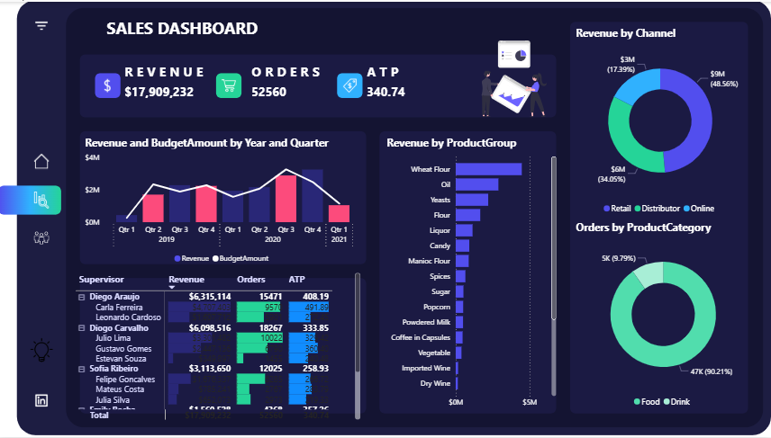
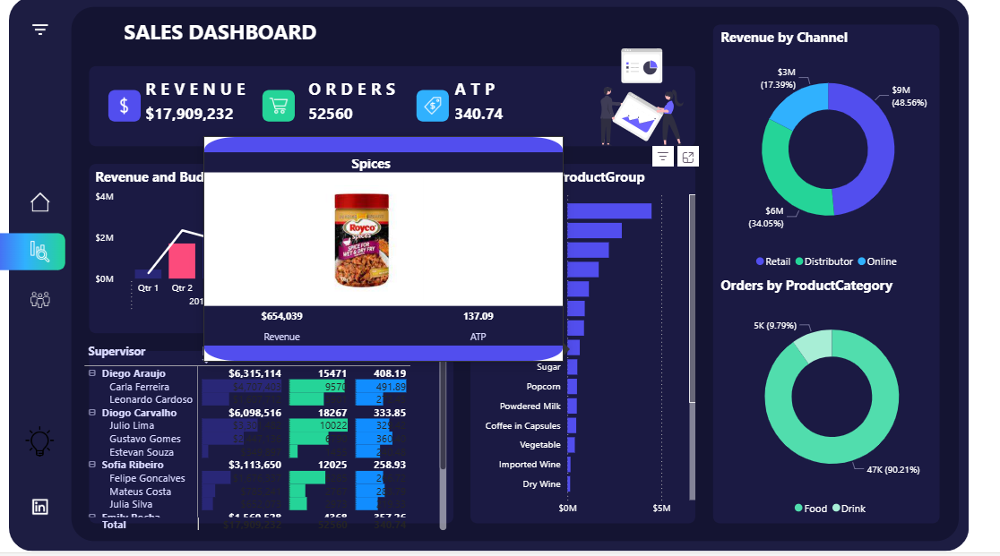
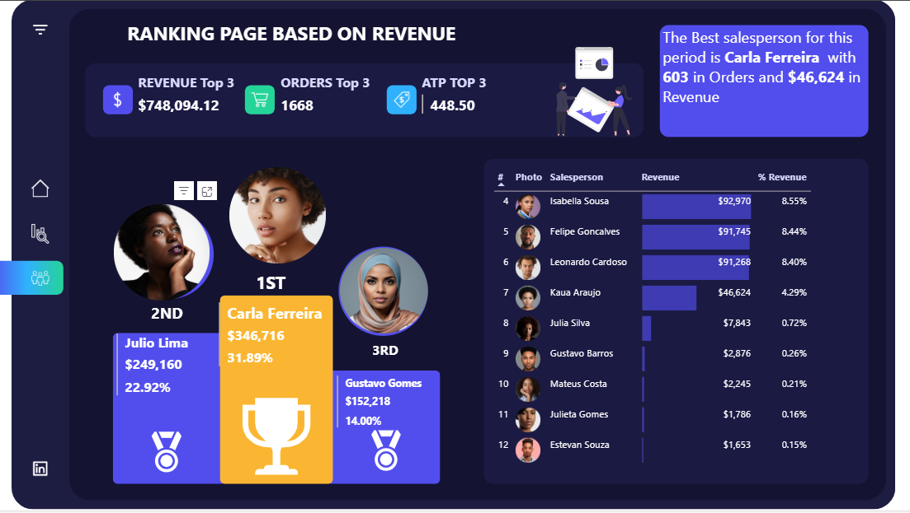
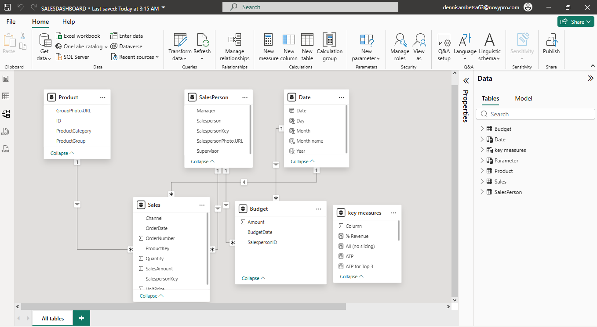

This Sales Dashboard project provides a comprehensive overview of revenue, orders, and salesperson performance. It features an interactive interface with advanced tooltip integration and a specialized ranking system for the sales team.

### Sales Performance Dashboard
This repository contains the assets and documentation for a professional Power BI Sales Dashboard. The report is designed to track key performance indicators (KPIs) and provide deep insights into regional and individual salesperson performance.

## Key Features
Executive Summary: A high-level view of Total Revenue ($17.9M), total Orders (52,560), and Average Transaction Price ($340.74).

Ranking Page: A dedicated page visualizing the top performers (1st, 2nd, and 3rd place) using circular portrait icons and performance medals.

Interactive Tooltips: Hovering over product groups or salesperson names reveals custom tooltips containing high-resolution images hosted on GitHub.

Dynamic Filtering: A sidebar filter pane allows users to slice data by Year (2019–2021), Manager, Supervisor, and specific Salesperson.

## Project Structure
[/PersonsImages](https://github.com/dzulee/Power-BI-images-tooltip/PersonsImages): Contains the circular portrait assets used for the salesperson ranking visuals.

[/ProductsImages](https://github.com/dzulee/Power-BI-images-tooltip/ProductsImages): Contains the circular portrait assets used for the salesperson ranking visuals.

[SalesDashboard.pbix](https://app.powerbi.com/view?r=eyJrIjoiMjU5ZDk5NjEtMTI1Ni00NzI1LTgyODQtMTkyMjNjZjI1M2IzIiwidCI6ImRmODY3OWNkLWE4MGUtNDVkOC05OWFjLWM4M2VkN2ZmOTVhMCJ9): The core Power BI report file.

README.md: Documentation and setup guide.

## Setup Instructions
Clone the Repo: Use git clone https://github.com/dzulee/Power-BI-images-tooltip.git to get the local files.

Data Category: Ensure that the Image URL column in Power BI is set to the Image URL data category to render the GitHub-hosted portraits correctly.

Tooltip Configuration: The "ProductPhoto" and "Gauge indicator" tooltips are linked to specific report pages set to Tooltip size in the Canvas Settings.

## Tech Stack
Power BI Desktop: Report authoring and DAX measures.

GitHub: Image hosting and version control.

Git Bash/Terminal: Used for managing repository assets.

## Key DAX Formulas
These measures ensure data remains dynamic regardless of the filters applied.

1. Total Revenue
This measure calculates the sum of all sales.

Revenue=SUM( 
′
 Sales 
′
 [SalesAmount])
2. Orders Count
Calculates the total number of unique orders processed.

TotalOrders= DistinctCOUNT( 
′
 Sales 
′
 [OrderNumber])
3. Average Transaction Price (ATP)
This KPI helps monitor the average value per order.

ATP=DIVIDE([Revenue],[TotalOrders],0)
4. Dynamic Image URL

SalespersonPortrait = "[https://github.com/dzulee/Power-BI-images-tooltip/blob/main/](https://github.com/dzulee/Power-BI-images-tooltip/blob/main/)" & 'Salesperson'[Name] & ".jpg?raw=true"

 

## Design Philosophy
Consistency: All salesperson portraits are formatted as circles with a grey border to match the "Ranking Page" aesthetic.

Accessibility: The filter pane uses a semi-transparent blue overlay, ensuring the dashboard background remains visible while the user makes selections.

Visual Hierarchy: Gold, Silver, and Bronze medals are used on the "Ranking Page" to instantly identify the top 3 performers.
##🏗️ Data Architecture
The project follows a Star Schema model to ensure optimal performance and scalability.

  

Fact Tables: Sales, Budget.

Dimension Tables: Product, SalesPerson, Date.

Key DAX Measures:

Revenue = SUM('Sales'[SalesAmount])

ATP = DIVIDE([Revenue], [Total Orders], 0)

% Revenue = DIVIDE([Revenue], [All (no slicing)], 0)
